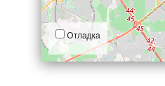

# Куда пойти - Проект по Джанго

Тестовый проект по Django о самых интересных местах в Москве.
<br>
[Источник](https://github.com/devmanorg/where-to-go-frontend/?tab=readme-ov-file)


## Как запустить

* Скачайте код
* Перейдите в корневую папку проекта
* Создайте виртуальное окружение
* Установите зависимости

```bash
$ pip install -r requirements.txt
```

* Создайте .env файл и скопируйте содержимое .env.example
* Поменяйте данные под свой проект
* Экспортируйте переменные из .env в переменные окружения
* Сделайте миграцию в базу данных

```bash
$ python manage.py migrate
```

* Создайте супер пользователя для админки

```bash
$ python manage.py createsuperuser
```

* Запустите проект
```bash
$ python manage.py runserver
```

## Настройки



Настройки сохраняются в Local Storage браузера и не пропадают после обновления страницы. Чтобы сбросить настройки, удалите ключи из Local Storage с помощью Chrome Dev Tools —&gt; Вкладка Application —&gt; Local Storage.

Если что-то работает не так, как ожидалось, то начните с включения отладочного режима логгирования.

<a href="#" id="data-sources"></a>

## Источники данных
Фронтенд получает данные из базы данных. <br> 
* Сперва передает общая информация о всех места с координатами в HTML. И ссылку на детальную информацию о месте, передав id локации. 
Пример: /places/1 <br>
* Нажимая на одну из точек можно получить более детальную информацию о месте, делая запрос по id локации

## Используемые библиотеки
* [Django](https://www.djangoproject.com/)
* [django-admin-sortable2](https://pypi.org/project/django-admin-sortable2/)
* [pillow](https://pypi.org/project/pillow/)
* [django-tinymce](https://pypi.org/project/django-tinymce/)
